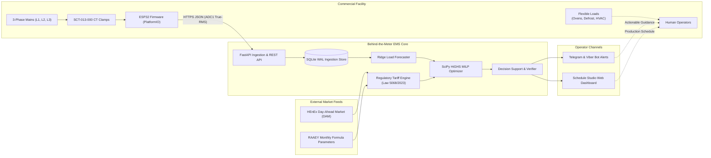

# Greek Commercial Behind-the-Meter Energy Management System (EMS)

[](https://www.python.org/)
[](https://fastapi.tiangolo.com)
[](https://platformio.org/)
[](https://ypen.gov.gr)
[](https://www.elot.gr)
[-success.svg)](docs/tariff_validation_report.md)
[](docs/measurement_uncertainty_report.md)
[](tests/)

An advisory energy-management and load-scheduling platform for commercial small-to-medium businesses (SMBs), combining behind-the-meter IoT telemetry, Greek electricity tariff modeling (Law 5068/2023, HEnEx Day-Ahead Market), and equipment-constrained Mixed-Integer Linear Programming (MILP). Human operators review actionable recommendations before adjusting equipment operation.

---

## Table of Contents
1. [Purpose & Commercial Context](#1-purpose--commercial-context)
2. [Architectural & Functional Anatomy](#2-architectural--functional-anatomy)
3. [Commercial & Technical Potential](#3-commercial--technical-potential)
4. [Current State & Engineering Maturity](#4-current-state--engineering-maturity)
5. [Reproducible Evidence & Benchmarks](#5-reproducible-evidence--benchmarks)
6. [Quickstart Guide](#6-quickstart-guide)
7. [Generic SME Equipment Schedule Studio](#7-generic-sme-equipment-schedule-studio)
8. [Technical Feature Inventory (F01–F34)](#8-technical-feature-inventory-f01f34)
9. [Documentation Index](#9-documentation-index)
10. [Regulatory Compliance & Electrical Safety](#10-regulatory-compliance--electrical-safety)

---

## 1. Purpose & Commercial Context

### 1.1 The Market Problem
Commercial electricity consumers in Greece—such as artisan bakeries, cold-storage logistics facilities, boutique hotels, and light manufacturing plants—operate under demanding grid and financial conditions:

1. **Extreme Tariff & Wholesale Volatility**: Under Law 5068/2023, retail tariffs (Green, Yellow/Dynamic, Orange) fluctuate monthly or hourly based on the Hellenic Energy Exchange (HEnEx) Day-Ahead Market (DAM). Price spikes during evening peak hours can reach 3× to 5× off-peak rates, while midday solar peaks can occasionally induce near-zero or negative wholesale prices.
2. **Punitive Capacity & Demand Charges**: Commercial tariffs (Γ21, Γ22, Γ23) impose steep surcharges for exceeding contracted capacity (kVA), strict dual-zone peak windows (DEDDIE winter/summer schedules), and severe distribution penalties (+40% surcharge on network usage) when average power factor ($\cos\varphi$) falls below 0.85.
3. **The "Smart Meter Vacuum"**: Over 80% of Greek low-voltage commercial connections still lack DEDDIE smart interval meters. Business owners receive utility bills weeks or months after consumption, preventing real-time intervention and billing dispute resolution.

### 1.2 Market Positioning & The Competitive Gap
Existing energy management solutions leave SMBs unserved:
* **Industrial BMS/EMS (Schneider EcoStruxure, Siemens, Meazon, Yodiwo)**: Capital expenditures between €3,000 and €10,000+ plus recurring SaaS fees make them economically prohibitive for small commercial sites.
* **Commercial DIN-Rail Meters (Shelly Pro 3EM, HAM Systems)**: Affordable hardware (€120–€250) providing *"dumb telemetry"*; they log raw kW and kWh without regulatory tariff intelligence, HEnEx DAM awareness, capacity surcharge forecasting, or operational equipment models.
* **Utility Mobile Apps (PPC myEnergy Coach, Protergia)**: Static hindsight reporting based on delayed grid meter reads.

### 1.3 The Core Solution
This Behind-the-Meter EMS provides an **equipment-aware, regulatory-intelligent advisory layer**:
* **Low Capital Requirement**: Compatible with sub-€50 ESP32/CT hardware or off-the-shelf certified Modbus/LAN DIN-rail meters.
* **Human-in-the-Loop Advisory (Non-Actuating)**: Rather than risky automated switching of delicate equipment, the system generates verified operational schedules and proactive alerts (via web dashboard, Telegram, and Viber) for staff review.



---

## 2. Architectural & Functional Anatomy

The repository consists of six modular subsystems:

```
e:\project1\
├── firmware/              # ESP32 C++ PlatformIO: 3-phase sampling, RMS, ring buffer
├── backend/               # FastAPI async service, SQLite WAL persistence, security
│   ├── database/          # Connection manager, schema migrations, WAL pragmas
│   ├── market/            # HEnEx DAM scrapers, market history cache
│   ├── models/            # Pydantic v2 schemas with physical validation invariants
│   └── routes/            # REST API endpoints (telemetry, schedule, optimization)
├── tariff_engine/         # Greek regulatory billing engine, contracts, unit conversions
│   ├── adapters/          # Pluggable market adapters (Greek, German, Spanish)
│   ├── contracts.py       # Γ21, Γ22, Γ23 contract definitions and peak schedules
│   ├── green_tariff.py    # Law 5068/2023 fluctuation mechanism (MD)
│   ├── yellow_dynamic.py  # DAM-indexed dynamic tariff formulas
│   └── units.py           # Strict wholesale-to-retail unit conversions (€/MWh -> €/kWh)
├── optimization_engine/   # Operational scheduling, SciPy HiGHS MILP, decision cards
│   ├── solver.py          # Multi-period MILP formulating energy & capacity costs
│   ├── decision_support.py# Human-readable cards, demand savings, critical alerts
│   ├── forecasting.py     # 24h rolling load forecaster (Ridge vs persistence)
│   └── scheduling_service.py # Schedule Studio execution and window enforcement
├── bot/                   # Proactive Viber & Telegram messaging with anti-spam engine
└── scripts/ & reports/    # BDG2 public benchmarks, ML evaluations, E2E test harness
```

### 2.1 Embedded Telemetry Subsystem (`firmware/`)
* **Hardware Architecture**: Implemented in C++ for the ESP32-WROOM-32 via PlatformIO.
* **3-Phase Sampling**: Uses three non-invasive SCT-013-000 current clamps ($2000:1$ ratio) biased to $1.65\text{ V}$ with an $18\,\Omega$ burden resistor.
* **ADC Allocation**: Strictly restricted to ESP32 **ADC1** pins (GPIO 32, 34, 35). This avoids the hardware conflict where the ESP32 Wi-Fi RF driver locks ADC2 and corrupts analogue reads.
* **Store-and-Forward**: A 64-slot ring buffer holds readings during Wi-Fi outages to prevent data loss.
* **Provenance Tagging**: Telemetry payloads carry explicit provenance (`estimated_nominal_voltage_pf`), preventing uncalibrated current measurements from pretending to be certified Class 0.5 active power meters.

### 2.2 Ingestion & Persistence Engine (`backend/`, `backend/database/`)
* **FastAPI Async Pipeline**: High-throughput `/api/v1/telemetry` ingestion endpoint.
* **Physical Validation Invariants**: Pydantic v2 schemas reject physical anomalies (e.g., phase imbalance violations $|P_{\text{total}} - \sum P_i| > 0.05\text{ kW}$) and strictly reject non-finite inputs (`allow_inf_nan=False`).
* **SQLite WAL Durability**: SQLite configured in `WAL` mode with `PRAGMA synchronous=NORMAL` and immediate transactions. Counter-delta accumulation eliminates double-counting on device reboots and rejects duplicate/stale timestamps with HTTP 409.

### 2.3 Regulatory Tariff Engine (`tariff_engine/`)
* **Law 5068/2023 Compliance**: Implements the official Greek retail electricity tariff categories:
  * **Green Tariffs**: Base rate plus the monthly fluctuation mechanism ($MD = \alpha \cdot [TEA_{m-1} - Lu] + \beta$).
  * **Yellow/Dynamic Tariffs**: Indexed directly to hourly HEnEx DAM prices with explicit unit conversions via [`tariff_engine/units.py`](tariff_engine/units.py).
  * **Commercial Contracts (Γ21, Γ22, Γ23)**: Incorporates DEDDIE peak/off-peak windows, seasonal winter/summer shifts, and public holiday handling.
* **Regulated Surcharges**: Full line-item breakdown including DEDDIE distribution, ADMIE transmission, ETMEAR renewable fees, YKO public utility charges, special consumption tax, and VAT.
* **Timezone Normalization**: All market lookups and peak window evaluations are strictly locked to `ZoneInfo("Europe/Athens")`.

### 2.4 Mathematical Optimization Engine (`optimization_engine/`)
* **Formulation**: Formulates a rolling 24-hour multi-period Mixed-Integer Linear Program (MILP) solved using the high-performance **HiGHS** solver in SciPy (<25 ms solve times).
* **Objective Function**:
  $$\min \sum_{t=0}^{H-1} \left( C_t \cdot P_{\text{total}, t} \cdot \Delta t + \lambda_{\text{cap}} \cdot S_t \right)$$
  Minimizes total dynamic energy purchase cost subject to energy rates $C_t$, plus an optimizer penalty $\lambda_{\text{cap}}$ for exceeding contracted capacity limit $P_{\text{contracted}}$ via slack variable $S_t \ge 0$.
* **Equipment Constraints**:
  * **Cold Storage Defrost Cycles**: Shiftable within a bounded window $[t_{\text{nominal}} - \tau, t_{\text{nominal}} + \tau]$.
  * **Bakery Deck Ovens**: Contiguous, uninterruptible multi-hour production batches requiring binary activation variables $u_{\text{start}, k, t}$.
  * **HVAC Thermal Inertia**: Building thermal comfort deadbands ($T_{\min} \le T_t \le T_{\max}$) modeling ambient heat transfer and cooling power.
  * **BESS Storage**: Battery charge/discharge arbitrage bounds and round-trip efficiency constraints.

### 2.5 Decision Support & Auditing (`optimization_engine/decision_support.py`)
* **Card Generation**: Translates mathematical vector outputs into plain Greek and English operational cards (e.g., *"Shift defrost on Freezer #1 from 18:00 to 14:00 to avoid €0.28/kWh peak"*).
* **Truthful Financial Separation**: Clearly separates real calculated invoice savings (based on customer contractual rates) from solver internal tuning penalties.
* **Critical Breach Alerting**: Emits urgent warnings when equipment shifting cannot prevent an upcoming capacity breach.
* **Closed-Loop Counterfactual Verifier**: Evaluates actual post-event facility telemetry against the pre-intervention counterfactual baseline to classify execution success (`SUCCESS`, `PARTIAL`, `FAILED`).

### 2.6 Multi-Channel Alerting (`bot/`)
* **Telegram & Viber Integration**: Async bots capable of notifying plant managers on their mobile devices.
* **Anti-Spam State Machine**: Employs a 3-sample debounce, 30-minute cooldown timer, and 10% deadband hysteresis to avoid alarm fatigue.

---

## 3. Commercial & Technical Potential

### 3.1 Innovation Competition Showcase
* **High Viability**: Outstanding entry for programs like GreenTech Challenge, NBG Business Seeds, egg, and ClimateLaunchpad.
* **Demonstrated Depth**: Possesses authentic cross-domain engineering—from embedded C++ firmware and electrical safety constraints to operations research (MILP) and real regulatory energy code.

### 3.2 Low-Cost Single-Site Pilot Pathway
* **Target Profile**: A single commercial facility (e.g., a commercial bakery or a cold-storage warehouse) with 2–4 genuinely flexible electrical loads.
* **Shadow Pilot Feasibility**: Running in "shadow advisory mode" (advising staff without automated switching) eliminates the risk of production downtime or equipment damage while collecting real-world counterfactual data.
* **Commercial Meter Integration (Low-Cost Strategy)**:
  Rather than attempting custom high-voltage PCB manufacturing, CE/MID certification, and electrical enclosure compliance, the system can interface directly with an **off-the-shelf commercial meter (e.g., Shelly Pro 3EM or standard Modbus meter)**. At ~€120–€150 total hardware cost, this bypasses electrical product certification barriers and allows focus on the core software value: *regulatory intelligence and equipment scheduling*.

### 3.3 Competitive Moat & Strategic Positioning
* **Open Algorithms vs. Operational Moat**: The repository is MIT-licensed, so the MILP formulations and Python code are not proprietary black boxes.
* **Where Real Advantage Lies**:
  1. **Equipment Knowledge Base**: Pre-tuned models for specific equipment (baking deck thermal decay rates, commercial refrigeration defrost inertia).
  2. **Operator Trust & Workflows**: Practical UI and alerts that fit kitchen/warehouse shift patterns without causing operational friction.
  3. **Regulatory Adaptation**: Continuous maintenance of Greek market tariffs, DEDDIE circulars, and HEnEx DAM data pipelines.

---

## 4. Current State & Engineering Maturity

### 4.1 Technical Maturity Overview
* **TRL 5–6 (Technology Validated in Relevant Environment)**.
* **713 Unit & Integration Tests Passing** (`pytest` with native runtime thread limits).
* **PlatformIO ESP32 Firmware**: Cleanly compiling within flash and RAM limits.
* **Working End-to-End**: Local development stack (`uvicorn`, SQLite, web dashboard) fully operational.

### 4.2 Recently Hardened (Phase 1 Progress)
Key architectural areas recently hardened:
1. **Greek Market Timezone Normalization**: Standardized `Europe/Athens` across all contract schedules, holiday calendars, and DAM market services, eliminating UTC misalignment.
2. **Strict Unit Conversions**: Eliminated fragile `< 1.0` price magnitude sniffing heuristics in yellow and green tariffs; centralized explicit €/MWh $\leftrightarrow$ €/kWh conversions in [`tariff_engine/units.py`](tariff_engine/units.py) with negative and zero wholesale price handling.
3. **Decoupled Decision Support Savings**: Separated solver mathematical penalty weights from reported financial savings; added critical alerts when load shifting cannot prevent capacity breaches.
4. **Finite Telemetry Schema Validation**: Hardened Pydantic models with `allow_inf_nan=False` to reject `NaN`, `+Inf`, and `-Inf` strings at API entry points.
5. **Deterministic Scheduling Engine Tests**: Resolved implicit weekend dependencies in generic schedule tests, ensuring reproducible execution 7 days a week.

### 4.3 Technical Boundaries & Disclosures

| Subsystem | Current State | Requirement for Live Commercial Deployment |
| :--- | :--- | :--- |
| **Power Measurement** | CT-only firmware measures RMS current; active power and energy assume 230V and PF 0.95. | Integrate a true voltage/energy meter (e.g., Modbus/Shelly Pro 3EM) or calibrate dedicated voltage sampling hardware. |
| **Firmware Transport** | HTTP/HTTPS client configured; Root CA certificate validation currently in progress. | Complete Phase 1 Sub-Project 2 (Task 3: Root CA TLS validation in C++). |
| **Telemetry Ingestion Quality** | Fast ingestion with deduplication; averages hourly readings naively. | Complete Phase 1 Sub-Project 2 (Task 2: minimum observation count & gap gating). |
| **Intervention Persistence** | Optimization cards and closed-loop verification results stored in-memory. | Persist recommendation cards, operator acceptances, and verification outcomes in durable SQLite tables. |
| **Tenant Isolation** | Single shared `API_KEY` environment variable. | Multi-tenant authentication, scoped device tokens, and role-based access control (RBAC). |
| **Forecast Generality** | Tested on public building datasets (BDG2); Ridge model performs well on convenience sample. | Ingest 3+ weeks of live facility history before relying on ML forecasts over persistence baselines. |

---

## 5. Reproducible Evidence & Benchmarks

| Evaluation | Evidence and scope |
|---|---|
| **Day-ahead ML** | [Ten-building BDG2 cohort](reports/real_data/FULL_DATASET_MULTI_BUILDING_BENCHMARK.md): MLP WAPE 7.62–28.50%, improving on previous-day persistence at 8 of 10 selected buildings; convenience sample, not a representative fleet. |
| **Runtime model** | [Full-year replay on three sites](reports/real_data/RUNTIME_FORECAST_BENCHMARK.md): WAPE 29.71%, 19.49%, 8.62%, compared with previous-day 32.56%, 19.83%, 8.93%. |
| **Monthly ML** | [Wolf retail 2017](reports/real_data/MONTHLY_NEURAL_NETWORK_BENCHMARK.md): full-day forecasts issued at midnight, with baselines and excluded days disclosed. |
| **Dispatch** | [Real-data scenarios](reports/real_data/REPORT.md): assumed tariffs/battery, including perfect-foresight scenarios; no achieved facility savings. |
| **Firmware** | ESP32 PlatformIO build and native C++ behavior regressions; physical accuracy and installation are not certified. |
| **Tariffs** | [Formula regression benchmark](docs/tariff_validation_report.md): synthetic expected bills check implementation consistency, not independent utility-bill reconciliation. |

---

## 6. Quickstart Guide

### 6.1 Installation
```bash
git clone https://github.com/DimThanasoulias/Behind-the-Meter-EMS.git
cd Behind-the-Meter-EMS

# Create virtual environment and install in editable mode
python -m venv .venv
source .venv/bin/activate  # On Windows: .venv\Scripts\Activate.ps1
pip install -e ".[dev,research,firmware]"
```

### 6.2 Run Automated Test Suite
```bash
# Set thread caps for numerical libraries on Windows/Linux
$env:OPENBLAS_NUM_THREADS="1"; $env:OMP_NUM_THREADS="1"  # PowerShell
pytest -v
```
All **713** unit, integration, and tiered end-to-end tests execute cleanly.

### 6.3 Start FastAPI Backend & Web Dashboard
```bash
uvicorn backend.main:app --host 0.0.0.0 --port 8000 --reload
```
Access endpoints:
* **Interactive Web Dashboard:** `http://localhost:8000/dashboard`
* **Schedule Studio UI:** `http://localhost:8000/dashboard` (Schedule Studio tab)
* **Interactive OpenAPI Documentation:** `http://localhost:8000/docs`

### 6.4 Run Standalone E2E Verification (< 30 Seconds)
```bash
# Commercial Bakery profile
python scripts/run_e2e_verification.py --profile bakery

# Cold Storage Facility profile
python scripts/run_e2e_verification.py --profile cold_storage

# Boutique Hotel profile
python scripts/run_e2e_verification.py --profile hotel
```

### 6.5 Run the Commercial Telemetry Simulator
Stream 24 hours of accelerated commercial load with peak breach injection:
```bash
python -m simulator.cli --profile bakery --speed 60x --url http://localhost:8000/api/v1/telemetry
```

---

## 7. Generic SME Equipment Schedule Studio

An SME-friendly, multi-resolution scheduling environment allowing facility owners to define electrical equipment and generate mathematical advisory schedules:

* **Multi-Resolution Solving**: Native support for 5, 15, 30, and 60-minute time intervals ($N \in \{288, 96, 48, 24\}$ slots).
* **Flexible Equipment Operating Models**:
  * Arbitrary rated kW and required duration.
  * Permissible time windows including midnight-crossing ranges (e.g., 22:00 to 06:00).
  * Strict contiguity constraints for non-interruptible loads (deck ovens, dishwashers, industrial machinery).
  * Distributed time-slot allocations for interruptible loads (water heaters, HVAC pre-cooling, EV chargers).
  * Must-run guarantees vs. graceful omission of lower-priority optional equipment under constrained capacity.
  * Soft preferred start times with priority-weighted penalties.
* **Conservative Baseline Uncertainty Buffer (+10%)**: Protects against physical breaker trips and replay infeasibility discovered during real-world empirical audits ($P_{\text{base, cons}} = 1.10 \times P_{\text{base}}$).
* **Advisory-Only Paradigm**: Strictly decision-support. Generates natural-language Greek operational explanations (`explanation_el`) for each asset without automatic hardware actuation.
* **Full REST API Suite**:
  * `GET/POST /api/v1/facilities/{facility_id}/assets`: Equipment inventory CRUD.
  * `GET/PUT/DELETE /api/v1/facilities/{facility_id}/assets/{asset_id}`: Single asset operations.
  * `GET/PUT /api/v1/facilities/{facility_id}/schedule-settings`: Facility resolution, power limits, and objective modes (`cost`, `peak`, `balanced`).
  * `POST /api/v1/facilities/{facility_id}/schedules/preview`: Real-time schedule optimization preview with Gantt and load profile timeline.
  * `POST /api/v1/facilities/{facility_id}/schedules/save`: Persistent storage of approved schedules.
  * `GET /api/v1/facilities/{facility_id}/schedules`: Historical schedule retrieval.

---

## 8. Technical Feature Inventory (F01–F34)

| # | Feature | Subsystem | Description |
|---|---|---|---|
| **F01** | ESP32 Analog Sampling & ADC1 Pinout | Firmware | Non-invasive CT sampling using ADC1 (GPIO 34, 35, 32), DC bias (1.65V), avoiding Wi-Fi ADC2 conflict |
| **F02** | SCT-013 Burden Resistor Derivation | Firmware | Exact derivation for SCT-013-000 ($18\,\Omega$ for 3.3V) and SCT-013-030 internal burden |
| **F03** | 3-Phase Electrical Power Calculations | Firmware | Computation of True RMS current, active power ($P$), apparent power ($S$), power factor ($\cos\varphi$) |
| **F04** | Trapezoidal Cumulative Energy Integration | Firmware | Real-time numeric integration of active power into cumulative kWh |
| **F05** | ESP32 Wi-Fi & Reconnection Resilience | Firmware | Automatic exponential backoff reconnection for Wi-Fi and HTTPS/MQTT endpoints |
| **F06** | ESP32 Telemetry Store-and-Forward | Firmware | In-memory ring buffer holding telemetry readings during temporary network dropouts |
| **F07** | PlatformIO Clean Build Configuration | Firmware | Clean compilable `platformio.ini` for `esp32dev` board without warnings/errors |
| **F08** | Greek Tariff Contract Γ21 (LV Commercial) | Tariff Engine | Single-rate commercial tariff modeling for $\le 25\text{ kVA}$ connections |
| **F09** | Greek Tariff Contract Γ22 (Dual Rate) | Tariff Engine | Commercial dual-rate tariff modeling with DEDDIE peak and off-peak windows |
| **F10** | Greek Tariff Contract Γ23 (MV Commercial) | Tariff Engine | Medium voltage commercial structure modeling ($> 250\text{ kVA}$) |
| **F11** | Green Tariff Fluctuation Mechanism | Tariff Engine | Official Law 5068/2023 / MD ΥΠΕΝ formula with TEA, $\alpha$, $L_u$, $L_l$, $\beta$ parameters |
| **F12** | Yellow & Dynamic Hourly Spot Tariff | Tariff Engine | Day-Ahead Market (DAM) hourly spot price indexing with supplier margins |
| **F13** | Regulated Charges Modeling | Tariff Engine | DEDDIE distribution, ADMIE transmission, ETMEAR, YKO, EFK, DETE, and 6% VAT |
| **F14** | Capacity Excess & Power Factor Penalties | Tariff Engine | Penalties for exceeding contracted kVA and $\cos\varphi < 0.85$ distribution multiplier |
| **F15** | Real-Time Running Cost (€/h) & Daily Spend | Tariff Engine | Instantaneous €/h calculation, daily spend accumulator, and baseline delta |
| **F16** | Projected Peak-Hour Surcharge Calculation | Tariff Engine | Mathematical projection of excess cost during active peak tariff windows |
| **F17** | Backend Telemetry Ingestion API | Backend | FastAPI REST endpoint (`POST /api/v1/telemetry`) with Pydantic v2 payload validation |
| **F18** | Electrical Invariant Validation | Backend | Strict backend checks ensuring $\vert P_{tot} - \sum P_i \vert \le 0.05\text{ kW}$ and $\cos\varphi \in [-1, 1]$ |
| **F19** | SQLite Time-Series Storage | Backend | High-throughput SQLite storage with WAL mode, facility indexing, and query APIs |
| **F20** | Facility Status & Cost Endpoints | Backend | `GET /api/v1/facilities/{id}/status`, `/cost-today`, `/tariff` for dashboards and bot queries |
| **F21** | Proactive Peak Breach Alert Generation | Alerting | Automated triggering of proactive alerts when load breaches kW threshold during peak rates |
| **F22** | Greek Alert Notification Templates | Alerting | Greek messages with kW, peak window, estimated € penalty, and tailored curtailment advice |
| **F23** | Alert Throttling, Cooldown & Hysteresis | Alerting | 3-sample debounce, 30-min cooldown, $\ge 25\%$ escalation jump, 10% release hysteresis |
| **F24** | Telegram Bot Greek Command Handlers | Alerting | Interactive commands (`/start`, `/status`, `/cost_today`, `/tariff`, `/settings`, `/help`) |
| **F25** | Dual Telegram Client Architecture | Alerting | `MockTelegramClient` for deterministic offline testing + `LiveTelegramClient` for production |
| **F26** | Commercial Telemetry Simulator CLI | Simulator | Parametric simulation for Commercial Bakery, Cold Storage, and Boutique Hotel |
| **F27** | Simulator Fast-Forward & Breach Triggering | Simulator | Configurable time-compression (`--speed`), Gaussian noise (`--noise`), and breach injection |
| **F28** | Hardware Wiring Schematics & Safety Guide | Hardware | Complete circuit diagrams, SCT-013 CT clamp connections, burden resistor sizing, and safety rules |
| **F29** | System Deployment & Operation Guide | Deployment | Production setup guide with PlatformIO, systemd, `.env`, Telegram bot setup, and runbook |
| **F30** | End-to-End Automated Integration Test Suite | Testing | Standalone automated script executing under 30s, verifying full pipeline from simulator to alert |
| **F31** | Live Greek Energy Market Price Ingestion | Market Feeds | Scraping of monthly RAE Green tariffs & 24h HEnEx DAM spot prices with 4-tier caching |
| **F32** | Unified Multi-Channel Alerting & Viber Bot | Alerting | Multi-channel dispatching (`telegram`, `viber`, `both`), `MockViberClient`, live Viber webhook, HMAC check |
| **F33** | Interactive Real-Time Web Dashboard | Dashboard UI | Responsive Single-Page UI at `/dashboard` with 3-phase live metrics, DEDDIE badges, 24h load curve |
| **F34** | Generic SME Equipment Schedule Studio | Optimization | Multi-resolution (5/15/30/60m) MILP advisory scheduler with conservative uncertainty buffer (+10%), Greek explanations, and REST API |

---

## 9. Documentation Index

| Guide | Document Link | Description |
|---|---|---|
| **Product & Competition Dossier** | [`docs/product/PRODUCT_DOSSIER.md`](docs/product/PRODUCT_DOSSIER.md) | Competition pitch evidence, demonstration flow, commercial hypotheses, and reproduction commands. |
| **Repository Review & Audit** | [`docs/product/REPOSITORY_REVIEW_2026-10-01.md`](docs/product/REPOSITORY_REVIEW_2026-10-01.md) | Exhaustive code, documentation, and technical feasibility review with prioritized findings. |
| **Field Pilot & IPMVP Protocol** | [`docs/product/field_pilot_protocol_ipmvp.md`](docs/product/field_pilot_protocol_ipmvp.md) | 8-week shadow-mode single-site pilot protocol following IPMVP Option B guidelines. |
| **Tariff & Bill Audit Report** | [`docs/tariff_validation_report.md`](docs/tariff_validation_report.md) | Calculation regression benchmark across 9 Greek bills (Γ21, Γ22, Γ23, Green, Yellow, Dynamic) with 0.00% formula discrepancy. |
| **Measurement Uncertainty Report** | [`docs/measurement_uncertainty_report.md`](docs/measurement_uncertainty_report.md) | ISO/IEC Guide 98-3 GUM error budget, ESP32 ADC linearization, and CT phase-shift compensation. |
| **Hardware Schematics & Wiring** | [`docs/wiring_schematic.md`](docs/wiring_schematic.md) | SCT-013 CT clamp connections, burden resistor calculation ($18\,\Omega$), ADC1 pinout, virtual ground, and ELOT 60364 safety rules. |
| **Hardware Bill of Materials (BOM)** | [`docs/hardware_bom.md`](docs/hardware_bom.md) | Sub-€50 hobby component list, part numbers, suppliers, PCB layout, and DIN-rail enclosure guidance. |
| **Greek Commercial Electricity Tariffs** | [`docs/greek_tariffs_guide.md`](docs/greek_tariffs_guide.md) | Analysis of contracts Γ21, Γ22, Γ23, Law 5068/2023 Green tariff formula, DEDDIE peak schedules, and power factor penalties. |
| **REST API Reference** | [`docs/api_reference.md`](docs/api_reference.md) | FastAPI endpoint documentation, optimization endpoints (`/api/v1/optimization`), market feeds, Viber webhook, and dashboard. |
| **Telegram & Viber Bot Guide** | [`docs/telegram_bot_guide.md`](docs/telegram_bot_guide.md) | BotFather configuration, Viber bot tokens, webhook routing, anti-spam throttling, and Greek interactive commands. |
| **Production Deployment Guide** | [`docs/deployment_guide.md`](docs/deployment_guide.md) | Systemd unit configuration, environment variables, PlatformIO ESP32 firmware flashing, and operations runbook. |

---

## 10. Regulatory Compliance & Electrical Safety

* **ELOT 60364 / HD 384**: Electrical installations of buildings. Guarantees physical isolation between low-voltage signal wiring and 400V mains busbars.
* **Law 5068/2023 & MD ΥΠΕΝ**: Greek retail electricity market reorganization establishing Green, Yellow, and Dynamic retail tariffs.
* **DEDDIE & ADMIE Grid Codes**: Compliant with distribution network connection terms, contracted kVA thresholds, and low power factor surcharge schedules ($\cos\varphi < 0.85$).
