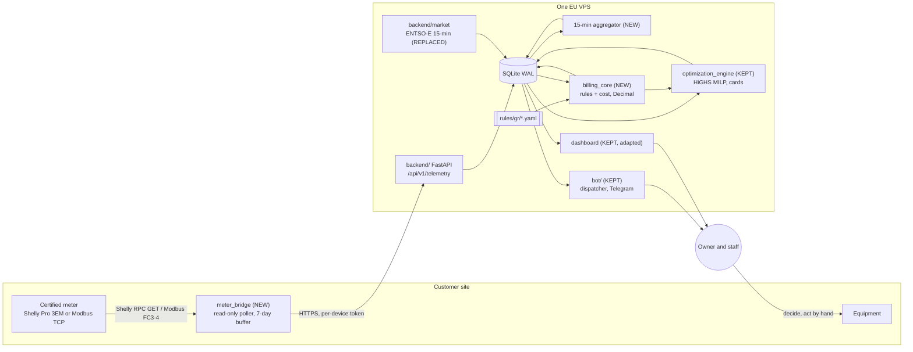

# Architecture (fork, pilot stage)

The contract (`docs/CONTRACT.md`) wins if this file disagrees with it.

## 1. Summary

A certified DIN-rail meter at the site is read by a small read-only bridge, which posts
measured telemetry every minute over HTTPS to one FastAPI server. The server stores data in
SQLite (WAL), turns counter readings into 15-minute energy, pulls next-day 15-minute prices,
prices every interval with `billing_core` and the sourced rule files, runs the upstream MILP
scheduler, and sends plans and alerts through Telegram. Staff decide. Nothing switches a device.

## 2. Components

## 3. Daily timeline (Athens local time)

| When | Job |
|---|---|
| Every minute | Bridge posts telemetry |
| Every 15 min | Aggregate interval energy; cost of last interval; DEMAND_PEAK_RISK and DATA_GAP checks |
| 14:00 to 16:00 | Fetch D+1 DAM prices with retries (results publish early afternoon) |
| 16:30 | Forecast D+1 base load, run MILP, store cards with price_basis DAM_ONLY |
| 17:15 | ORANGE sites: re-run with the supplier's published prices (due by 17:00) |
| 18:00 | Send PLAN_READY and PRICE_SPIKE_TOMORROW |
| 02:00 | Reconciliation, gap report, counter-reset check, SQLite backup |

## 4. Why this shape (pilot)

- SQLite WAL and HTTPS POST are what upstream already runs; they are enough for 1 to 10 sites.
  The contract keeps the payload stable so a later move to Postgres/TimescaleDB and MQTT
  changes adapters, not engines.
- The bridge is optional for Shelly sites if the server can poll them over a VPN, but a bridge
  gives buffering during internet outages; a Raspberry Pi or the site's always-on PC works.
- `billing_core` is new rather than a refactor of `tariff_engine` because the legacy engine
  hard-codes unsourced constants in many files; a clean pure package with property tests is
  cheaper to trust than an audit of every legacy line.

## 5. Out of scope until after the pilot

Automatic switching, batteries and PV control, other countries, own ESP32 hardware for
customers, ML forecasting beyond the upstream baseline, multi-tenant RBAC, Postgres, MQTT.
