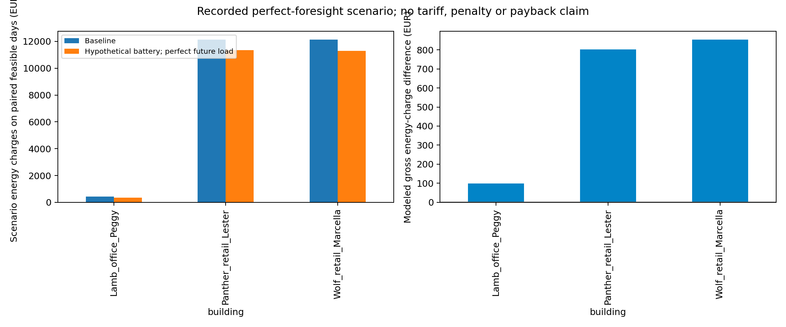
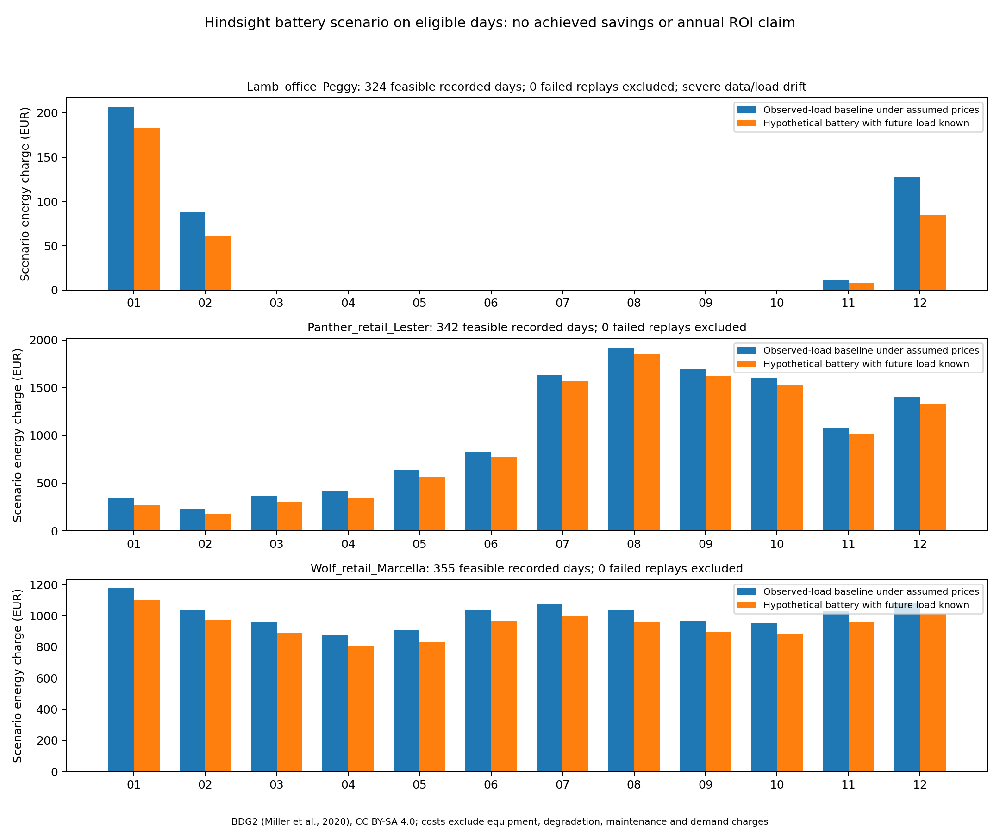

# Cost visualization provenance

These plots replace illustrative savings and payback amounts with recorded battery replay data from `dispatch_daily.csv`. Legacy filenames (realistic/scientific savings and peak-shaving) now show the first eligible hindsight scenario day; the filenames do not imply achieved savings. The neural-network figure uses the corrected midnight-origin MLP evaluation.
Only perfect-foresight scenarios are displayed; future measured load is known to the optimizer. Baseline and managed costs use the same physically feasible days. Excluded days receive no financial result. Results are not extrapolated to a full year.

Dispatch eligibility follows the original recorded benchmark, whose documented BDG2 quality policy excludes nonpositive readings. The newer MLP/profile evaluation retains zero targets. Their eligible-day counts therefore differ; these cost figures do not measure the newer MLP forecast benefit.

Assumptions from `manifest.json`:

{
  "rates_eur_kwh": [
    0.12,
    0.12,
    0.12,
    0.12,
    0.12,
    0.12,
    0.12,
    0.2,
    0.2,
    0.2,
    0.2,
    0.2,
    0.3,
    0.3,
    0.3,
    0.3,
    0.3,
    0.3,
    0.2,
    0.2,
    0.2,
    0.2,
    0.2,
    0.12
  ],
  "battery": "hypothetical 20 kWh / 5 kW, 94% efficiency each direction, daily initial/final target SOC 40%",
  "capacity": "2016 positive-load 95th percentile",
  "overload_objective": "assumed EUR 1 per excess kW per hourly slot; not a statutory tariff",
  "equipment": "battery only; no ovens/HVAC/defrost added to whole-building demand"
}

Energy-charge differences exclude hardware purchase, battery degradation, maintenance, financing and verified demand-charge savings. Contracted capacity is a hypothetical percentile threshold, not a known customer contract. No achieved savings, avoided penalties, power-factor benefits or payback is claimed.

Source: BDG2, Miller et al. (2020), https://doi.org/10.1038/s41597-020-00712-x; adapted outputs CC BY-SA 4.0.

