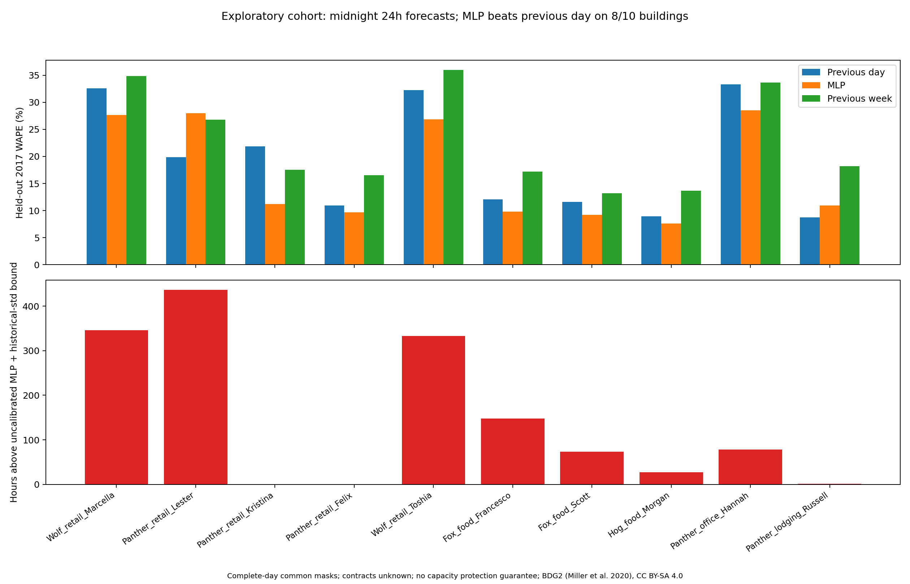

# Exploratory BDG2 commercial cohort benchmark

Fixed MLP (48,24), seed 42, trained on eligible 2016 observations and tested on 2017. All 24 hours are forecast at local midnight using only lag 24/48/168 and previous-day summaries. No intraday actuals or future weather are used; early stopping is confined to training data.
Timestamp gaps remain missing on a regular hourly index. Zeros are retained; negative/nonfinite values, incomplete feature/target days and local DST transition/dependent days are excluded. The same eligible hours are used for both baselines and MLP. Calendar source timestamps lack offsets/folds.

Ten predefined commercial candidates form a convenience cohort; this is not the full dataset, a representative fleet, a deployment benchmark, or a hardware test.

## File presence and header sampling

Only the first five rows are parsed. This checks local file presence/readability, not whole-file integrity, units, weather integration, or channel quality.

| File | Sample status | MB | Columns |
|---|---|---:|---:|
| metadata.csv | HEADER_READ | 0.26 | 32 |
| electricity.csv | HEADER_READ | 166.17 | 1579 |
| electricity_cleaned.csv | HEADER_READ | 166.87 | 1579 |
| weather.csv | HEADER_READ | 18.56 | 10 |
| solar.csv | HEADER_READ | 0.71 | 6 |
| gas.csv | HEADER_READ | 19.25 | 178 |
| chilledwater.csv | HEADER_READ | 75.19 | 556 |
| water.csv | HEADER_READ | 14.92 | 147 |

## Held-out 24h forecast results

| Building | Hours | Excluded days | R² | MAE kW | MLP WAPE | Previous-day WAPE | Previous-week WAPE | Heuristic coverage | Exceedance hours |
|---|---:|---:|---:|---:|---:|---:|---:|---:|---:|
| Wolf_retail_Marcella | 8568 | 8 | 0.211 | 1.872 | 27.68% | 32.56% | 34.81% | 95.96% | 346 |
| Panther_retail_Lester | 8328 | 18 | 0.681 | 1.892 | 27.97% | 19.83% | 26.80% | 94.75% | 437 |
| Panther_retail_Kristina | 8328 | 18 | 0.858 | 3.597 | 11.19% | 21.86% | 17.54% | 100.00% | 0 |
| Panther_retail_Felix | 8328 | 18 | 0.888 | 10.956 | 9.70% | 10.92% | 16.55% | 100.00% | 0 |
| Wolf_retail_Toshia | 8568 | 8 | 0.620 | 19.039 | 26.85% | 32.23% | 35.95% | 96.11% | 333 |
| Fox_food_Francesco | 8568 | 8 | 0.850 | 6.133 | 9.80% | 12.08% | 17.22% | 98.27% | 148 |
| Fox_food_Scott | 8568 | 8 | 0.872 | 6.857 | 9.19% | 11.59% | 13.20% | 99.15% | 73 |
| Hog_food_Morgan | 8568 | 8 | 0.924 | 4.874 | 7.62% | 8.93% | 13.70% | 99.68% | 27 |
| Panther_office_Hannah | 8328 | 18 | 0.523 | 1.707 | 28.50% | 33.33% | 33.63% | 99.06% | 78 |
| Panther_lodging_Russell | 8328 | 18 | 0.705 | 4.376 | 10.94% | 8.72% | 18.22% | 99.99% | 1 |

Heuristic upper value = MLP + 1.645 × 2016 weekday/hour load standard deviation. This is not calibrated P95 or the firmware model. Exceedance coverage does not establish capacity protection. Contracted capacities, capacity breaches and penalty savings are unknown. No test-set accuracy threshold or commercial readiness is asserted.

Exact metrics, model protocol, fit times, baselines, excluded-day counts, optimizer iteration limits and missing capacity values are saved in `cohort_metrics.csv`. Reaching the iteration limit is reported rather than treated as converged. MLP may underperform simple baselines; validation-based model selection and monitoring are needed before deployment.

Source: Building Data Genome 2, Miller et al. (2020), https://doi.org/10.1038/s41597-020-00712-x. Source and adapted outputs: CC BY-SA 4.0.

Training reached the 300-iteration limit (ConvergenceWarning): Wolf_retail_Toshia, Fox_food_Francesco. Results use the recorded fit without test-set retuning.

