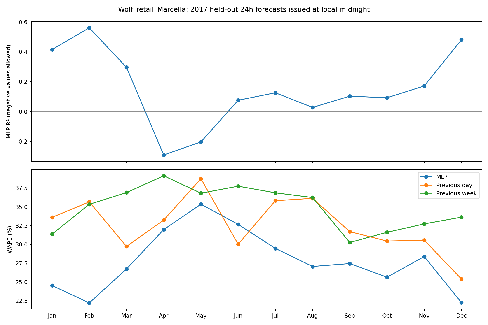
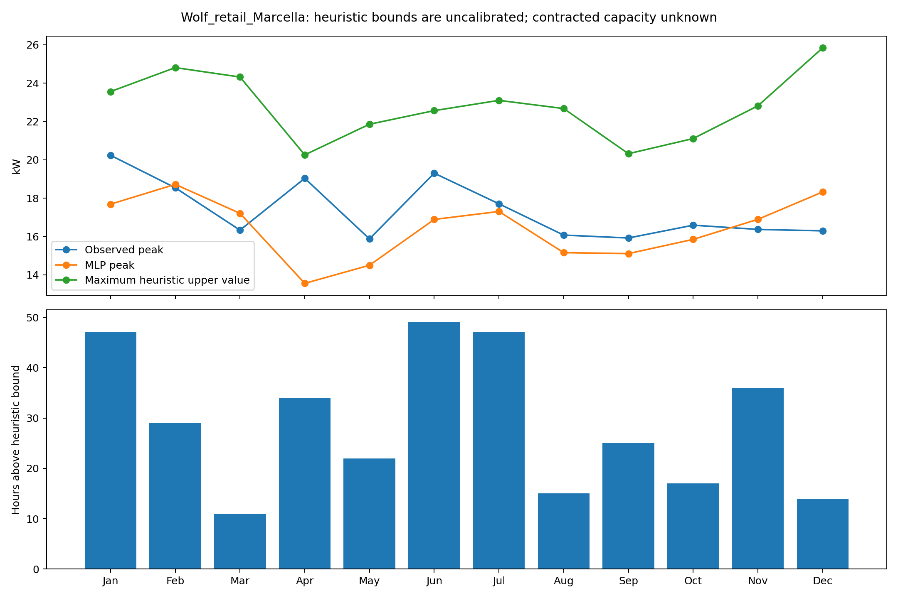

# Monthly MLP day-ahead evaluation

Building: `Wolf_retail_Marcella`; local timezone: `Europe/Dublin`.
Fit fixed MLP (48,24), seed 42, on 8424 eligible 2016 hours; test 8568 hours in 2017 (8 excluded days). Training plus prediction: 1.91 seconds.

Forecast origin is local midnight. All 24 forecasts use lag 24/48/168 and previous complete-day statistics available before midnight. No intraday actuals or future weather enter the inputs. Early stopping uses only 2016 data; no 2017 tuning.
Hourly kWh readings equal average kW for one-hour intervals. Zero readings are retained; missing/nonfinite/negative readings stay missing. Reindex before shifting, exclude incomplete feature/target days and local DST transition days and dependent lags. Energy totals cover eligible hours only.

The heuristic upper value is MLP + 1.645 × 2016 weekday/hour load standard deviation. It is not a calibrated P95, not the firmware forecaster, and not a capacity threshold. Hourly exceedances are recorded separately from maxima. Contracted capacity and breach/penalty outcomes are unknown.

| Month | Hours | MLP R² | MLP MAE kW | MLP WAPE | Previous-day WAPE | Previous-week WAPE | Heuristic coverage | Exceedance hours |
|---|---:|---:|---:|---:|---:|---:|---:|---:|
| Jan | 744 | 0.415 | 1.826 | 24.53% | 33.60% | 31.36% | 93.68% | 47 |
| Feb | 672 | 0.560 | 1.618 | 22.21% | 35.66% | 35.33% | 95.68% | 29 |
| Mar | 672 | 0.296 | 1.801 | 26.73% | 29.72% | 36.89% | 98.36% | 11 |
| Apr | 696 | -0.291 | 2.041 | 31.97% | 33.24% | 39.13% | 95.11% | 34 |
| May | 744 | -0.203 | 2.064 | 35.34% | 38.73% | 36.81% | 97.04% | 22 |
| Jun | 720 | 0.076 | 2.201 | 32.66% | 30.02% | 37.74% | 93.19% | 49 |
| Jul | 744 | 0.126 | 2.038 | 29.46% | 35.81% | 36.86% | 93.68% | 47 |
| Aug | 744 | 0.028 | 1.793 | 27.06% | 36.12% | 36.23% | 97.98% | 15 |
| Sep | 720 | 0.103 | 1.769 | 27.45% | 31.69% | 30.25% | 96.53% | 25 |
| Oct | 672 | 0.092 | 1.733 | 25.63% | 30.44% | 31.61% | 97.47% | 17 |
| Nov | 696 | 0.171 | 2.049 | 28.38% | 30.56% | 32.73% | 94.83% | 36 |
| Dec | 744 | 0.480 | 1.519 | 22.26% | 25.39% | 33.62% | 98.12% | 14 |

No accuracy, capacity protection, or savings guarantee is inferred. Compare baselines on the same eligible hours. See CSVs for exact metrics and observed/forecast energy and peaks.

Source: Building Data Genome 2, Miller et al. (2020), https://doi.org/10.1038/s41597-020-00712-x. Source data and adapted outputs: CC BY-SA 4.0.

