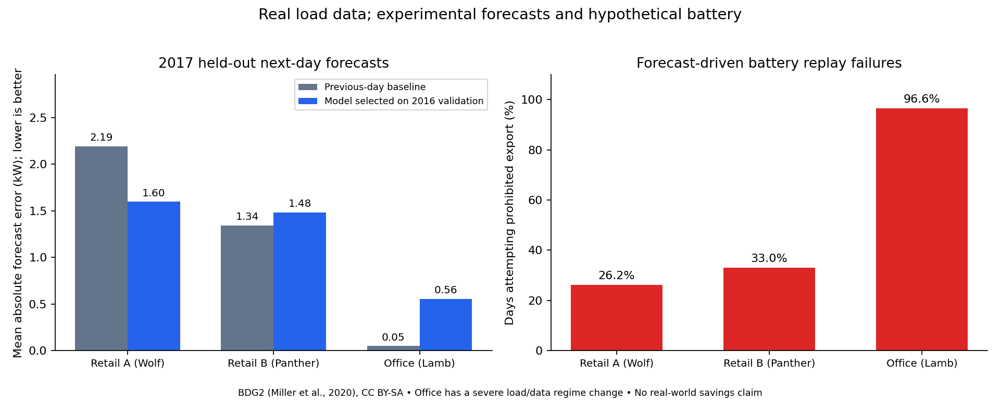

# Real measured-data experiment

This offline research benchmark tests forecast models and the existing EMS solver. It does not deploy ML, operate equipment, or verify savings at a Greek facility.

## Data and protocol

- Source: [Building Data Genome 2](https://github.com/buds-lab/building-data-genome-project-2), pinned to commit `9b97ccbe90096aff42ed4fd6493bf7ae692d7118`. Download SHA-256 values are checked against the Git LFS source objects.
- Three buildings selected by metadata before inspecting held-out results: two retail buildings and one office. This is an exploratory sample, not a representative commercial fleet.
- Raw readings are hourly kWh in local time. For these one-hour intervals, their numerical value is average kW. Source: [meter documentation](https://github.com/buds-lab/building-data-genome-project-2/wiki/Meters-data-features).
- Fit January–September 2016; select a method using October–December 2016 WAPE; refit on eligible 2016 data; test January–December 2017. The held-out year is not used for model choice or tuning.
- Forecast 24 hours at each local midnight using prior-day, two-day, week and two-week lags, previous complete-day summaries and calendar features. No future actual weather or load is used as a forecast input. Models remain fixed throughout 2017; observed past test days become available at subsequent origins.
- Compare previous-day, previous-week, Ridge regression and histogram gradient boosting. Hyperparameters are fixed in the script; there is no test-set search.
- Missing, nonfinite and nonpositive readings are treated as questionable, not interpolated. All methods use the same complete-day mask, including complete lag features. DST transition days and days depending on those lagged observations are excluded. Tiny positive readings remain in the primary results, explicitly flagged below.

## Next-day forecast results

WAPE = total absolute error / total observed load. Lower is better. MAE is in kW. A validation winner can lose on future data.

| Building | Test days | Selected on 2016 validation | Previous-day WAPE | Selected WAPE | Previous-day MAE | Selected MAE |
|---|---:|---|---:|---:|---:|---:|
| Wolf_retail_Marcella | 355 | gradient_boosting | 32.49% | 23.66% | 2.194 | 1.598 |
| Panther_retail_Lester | 342 | ridge | 19.84% | 21.88% | 1.344 | 1.482 |
| Lamb_office_Peggy | 324 | ridge | 18.62% | 211.86% | 0.049 | 0.556 |

## Data-quality and distribution changes

| Building | Mean kW 2016 | Mean kW 2017 | 2017 positive readings below 0.001 kW | Excluded 2017 days |
|---|---:|---:|---:|---:|
| Wolf_retail_Marcella | 7.253 | 6.755 | 0 | 10 |
| Panther_retail_Lester | 3.629 | 6.721 | 0 | 23 |
| Lamb_office_Peggy | 3.355 | 0.274 | 6886 | 41 |

The office series undergoes a large change and contains thousands of tiny positive readings. These could reflect meter/data problems or changed operations; this experiment cannot establish the cause. Large percentage errors on this series are a warning about data quality and model drift. The office has not been silently removed or used to retune the model. Its simulated financial result should not guide investment decisions.

## Scheduling replay

The battery is hypothetical: 20 kWh, 5 kW charge/discharge, 94% efficiency each direction, SOC bounds 15–95%, initial SOC 40%, terminal SOC at least 40%. Each day is an independent scenario. No controllable ovens/HVAC/defrost are added to aggregate metered load.

Assumed hourly prices are EUR 0.12/kWh at 00:00–07:00 and 23:00–24:00, EUR 0.30 at 12:00–18:00, and EUR 0.20 otherwise. The capacity threshold is the building's 2016 positive-load 95th percentile, with an artificial EUR 1 per excess kW per hourly slot in the objective. These are scenario parameters, not historical tariffs or statutory Greek demand charges.

A schedule is optimized against a forecast, then its battery commands are replayed against observed load. Export is prohibited by the model. A replay below -0.02 kW or above 500.02 kW is flagged infeasible, allowing 0.02 kW for rounded output. Infeasible plans receive no energy-cost result; they are not counted as successful savings.

| Building | Selected method | Solver failures | Infeasible on measured load | Total test days |
|---|---|---:|---:|---:|
| Wolf_retail_Marcella | gradient_boosting | 0 | 93 (26.2%) | 355 |
| Panther_retail_Lester | ridge | 0 | 113 (33.0%) | 342 |
| Lamb_office_Peggy | ridge | 0 | 313 (96.6%) | 324 |

Across all methods and buildings, 5,105 daily optimization problems were evaluated. The perfect-foresight diagnostic uses actual future load and has 0 solver failures and 0 infeasible replays. This establishes performance with known demand, not forecast reliability.

**Finding:** numerical solver success under a forecast does not guarantee physical feasibility under realized demand. The forecast-driven plans attempt to discharge more than the building consumes on many days. Autonomous deployment needs a real-time no-export/SOC controller and re-optimization, in addition to model monitoring and fallback forecasts.

For context only, the two retail buildings' hypothetical battery energy-cost results with perfect future-load knowledge are:

| Building | Baseline energy cost | Energy-cost reduction with hindsight | Reduction |
|---|---:|---:|---:|
| Wolf_retail_Marcella | EUR 12135.72 | EUR 854.06 | 7.04% |
| Panther_retail_Lester | EUR 12140.37 | EUR 801.67 | 6.60% |

These are modeled gross energy-charge changes over eligible test days. They exclude equipment purchase, degradation economics, maintenance and verified demand-charge savings. Perfect foresight optimizes the combined scenario objective, not energy cost alone. Do not interpret these figures as achieved savings or as an ML benefit. Per-method feasible-day subsets differ, so their totals in `dispatch_daily.csv` must not be compared as if they covered the same days.

## Conclusions

- ML can improve a stable building's forecast, but it did not beat the simplest baseline everywhere.
- Introduce per-building model monitoring and rolling validation, with a simple baseline available as fallback.
- Detect missing values, near-zero plateaus and operating-regime changes before trusting forecast-driven schedules.
- Add closed-loop dispatch guards before autonomous battery control. More training alone will not enforce physical limits under forecast error.

## Reproduce and inspect

Run `python scripts/run_real_data_benchmark.py` from the repository. The experiment additionally needs pandas, scikit-learn and matplotlib; exact versions are in `manifest.json`. Raw files are cached under `.agents/real_data/` and are not put into the operational telemetry database or version control. The initial source download is approximately 174 MB; outputs retain only three buildings.

Files: `forecast_metrics.csv`, `validation_metrics.csv`, `data_quality.csv`, `heldout_predictions.csv`, `dispatch_daily.csv`, `manifest.json`. Source and adapted data/plots in this report are attributed to Miller et al., *The Building Data Genome Project 2*, Scientific Data 7, 368 (2020), [DOI](https://doi.org/10.1038/s41597-020-00712-x), under the source repository's [CC BY-SA license](https://github.com/buds-lab/building-data-genome-project-2/blob/master/LICENSE). This report is shared under CC BY-SA 4.0.
